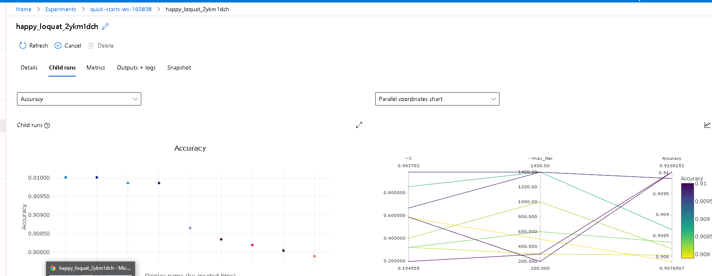
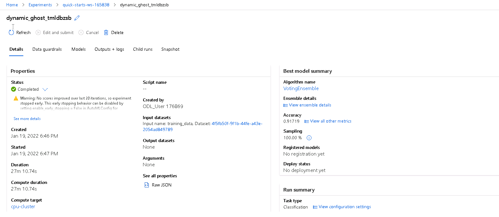
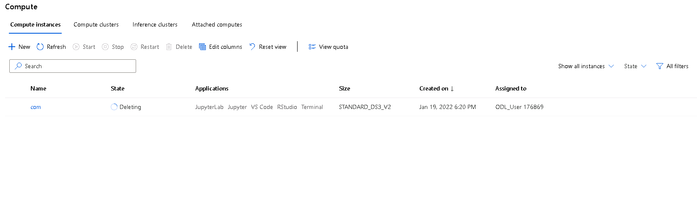

# **Optimizing an ML Pipeline in Azure**

**Overview**

This project is part of the Udacity Azure ML Nanodegree. In this project, we build and optimize an Azure ML pipeline using the Python SDK and a provided Scikit-learn model. This model is then compared to an Azure AutoML run.

**Summary**

The data for this project contains data of a bank campaign done for bank customers. The data contains information about the customers and the campaign done. We seek to predict column &quot;y&quot; using Hyperdrive and AutoML. Logistic regression from Sklearn, the best accuracy was happy\_loquat\_2ykm1dch with an accuracy metric of 0.9109187

And for AutoML the best model was Voting Ensemble with an accuracy of 0.91719

**Scikit-learn Pipeline**

**Explain the pipeline architecture, including data, hyperparameter tuning, and classification algorithm.**

The bank marketing dataset is retrieved from an URI through TabularDatasetFactory and split into 80% training and 20% testing sets. Logistic Regression is used from the scikit learn library, the model is trained. For hyperparameter turning in the Hyperdrive the Random Parameter Sampling choosing the uniform and quniform options. For the termination policy the BantIt policy was used which is based on slack factor and the evaluation interval. The primacy metric used in Accuracy

**What are the benefits of the parameter sampler you chose?**

Random sample can be used for both discrete and continuous hyperparameters and it supports early termination for runs that have low performance

**What are the benefits of the early stopping policy you chose?**

Early termination policy ends runs that poorly performing in order to improve the computational efficiency.

**AutoML**

**In 1-2 sentences, describe the model and hyperparameters generated by AutoML.**

The AutoML automated the ML pipeline using parameters such as expirement\_timeout in minutes, task, primary metrics, number of cross validations, and the dataset and compute details. The best model obtained from the AutoML is Voting Ensemble with the accuracy of 0.91719

**Pipeline comparison**

**Compare the two models and their performance. What are the differences in accuracy? In architecture? If there was a difference, why do you think there was one?**

One of the main difference between the hyperdrive and AutoML is that in hyperdrive we stipulate the model while in AutoML different models are trained then the best model is chosen. In this project the accuracy obtained from the hyperdrive is 0.9103187

AutoML best model was VotingEnsemble with an accuracy of 0.91719 therefore performed a little better than the model trained in the hyperdrive.

**Future work**

**What are some areas of improvement for future experiments? Why might these improvements help the model?**

I would explore the model using other parameters sampler and early termination policy to ascertain how it impact the model results.

For the AutoML, I will explore the use of other algorithms to see how it affects the model.

**Proof of cluster clean up**

**If you did not delete your compute cluster in the code, please complete this section. Otherwise, delete this section.**   **Image of cluster marked for deletion**

